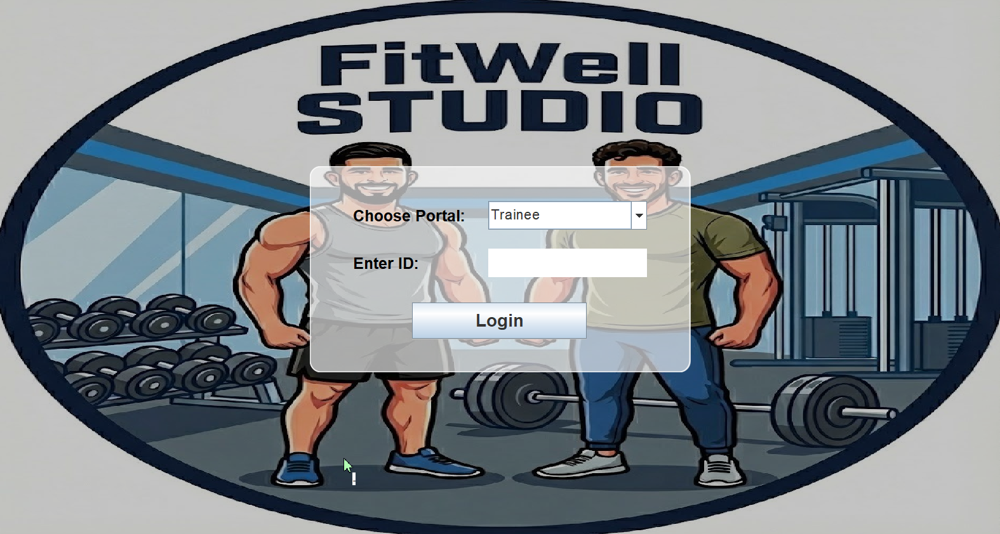
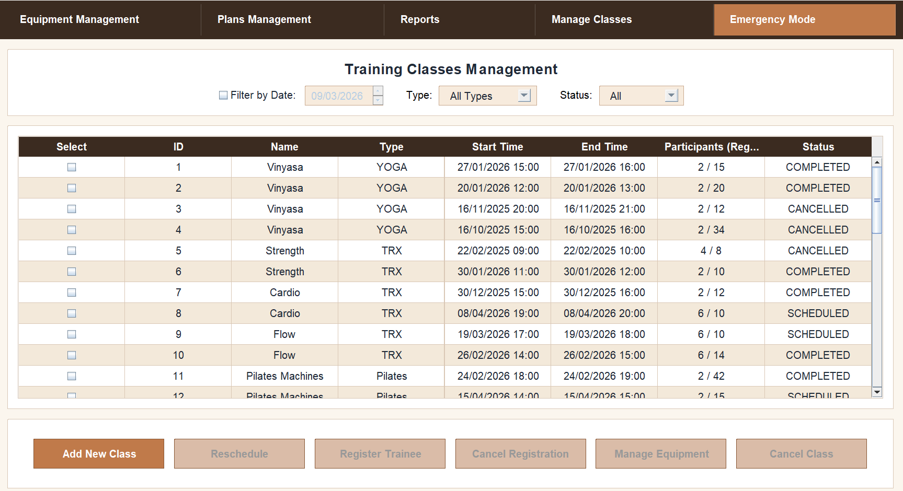
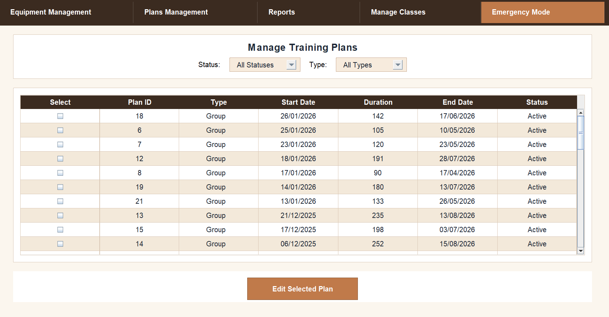
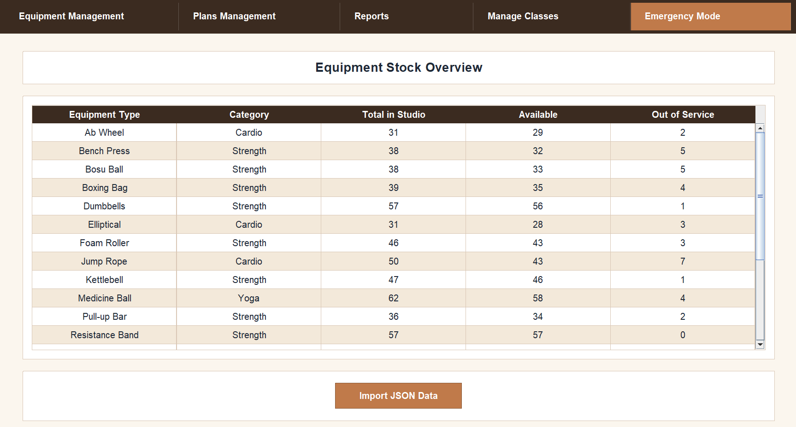
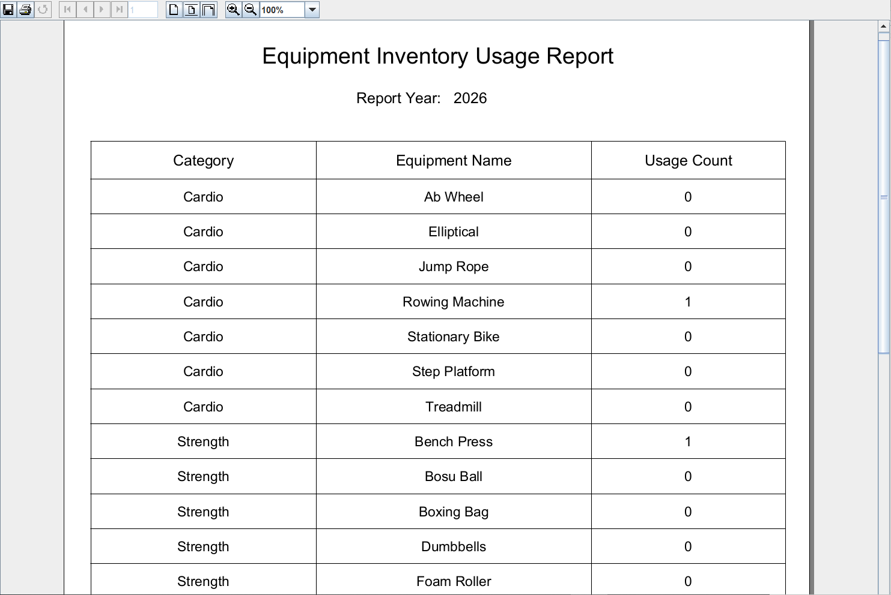
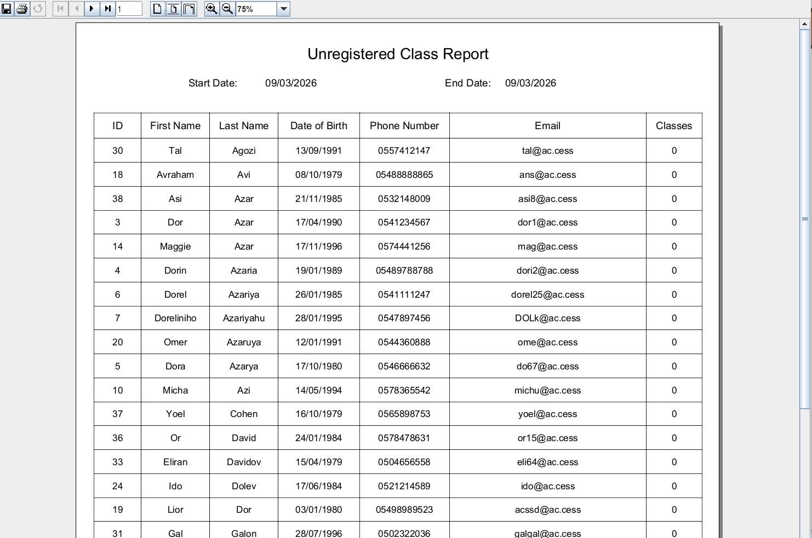

# FitWell - Fitness Club Management System

**FitWell** is a comprehensive management system for fitness groups and training, enabling user management, fitness plans, equipment, and class scheduling.

## Project Description

The FitWell system provides a user-friendly interface for complete management of fitness groups including:
- User Management (Trainee, Conultant, Dietitian, Studio Manager)
- Fitness Plans Management (personal and group plans)
- Equipment and Facility Management
- Class Scheduling and Trainee Registration
- Reports and Progress Notes

---

## Screenshots

### 1. Login Screen

*Authentication interface for system access*

### 2. Trainee Management Screen

*Screen for managing trainees and group assignments*

### 3. Fitness Plan Creation Screen

*Interface for creating customized fitness plans*

### 4. Equipment Management Screen

*Managing equipment inventory and facility resources*

### 5. Reports Dashboard

*View reports and compliance tracking*


*Detailed report generation interface*

---

## Project Structure

```
src/
├── boundary/          # User Interface (UI)
│   ├── FitWellPortalScreen.java
│   ├── TraineeScreen.java
│   ├── DietitianScreen.java
│   ├── StaffManagementScreen.java
│   └── [Admin Panels]
├── control/           # Business Logic
│   ├── TraineeRegisterControl.java
│   ├── FitnessPlanControl.java
│   ├── EquipmentControl.java
│   └── [Additional Controllers]
└── entity/            # Data Models
    ├── Trainee.java
    ├── FitnessPlan.java
    ├── TrainingClass.java
    └── [Additional Classes]

bin/                   # Jasper Reports
FitWellJAR/           # Database (Access)
lib/                  # External Libraries
```

---

## System Requirements

- **Java**: JDK 8 or higher
- **Database**: MS Access (Fitwell.accdb)
- **Libraries**: UCanAccess, JasperReports

---

## Key Features

- **User Management** - User registration and role-based management  
- **Fitness Plans** - Create personal and group fitness plans  
- **Class Management** - Class scheduling and trainee registration  
- **Equipment Tracking** - Monitor inventory and facility resources  
- **Reports** - Generate equipment and class reports  
- **Emergency Mode** - Emergency management with simulation  

---

## Usage

### Running the Application
```
java -jar FitWellJAR/[jar-file-name].jar
```

### Logging into the System
- Select user type (trainee, trainer, dietitian, or manager)
- Enter login credentials
- Access features appropriate to your role

---

## Development

### Adding a New Feature
1. Create a new entity class if needed
2. Create a control class to handle business logic
3. Create a boundary class (UI) with an intuitive interface

### Compiling the Project
```
javac -d bin src/**/*.java
```

---

## License

This is a Maccabi fitness group project.

---

## Contact

For questions and feedback, please contact the development team.
